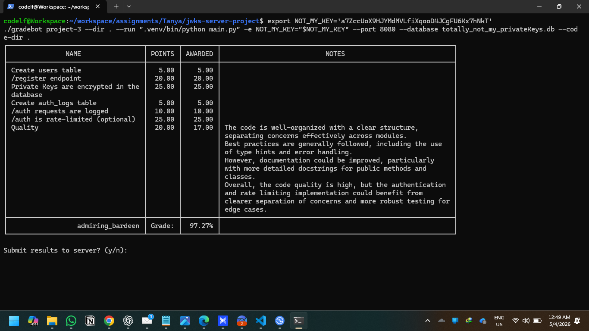
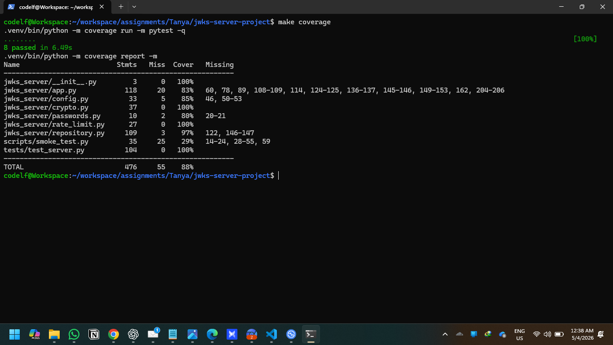

# JWKS Server Project

A Python implementation of the CSCE 3550 JWKS server assignments. The server uses SQLite for key and user storage, AES to encrypt persisted private keys, and RS256 JWTs for authentication responses.

## Submission Checklist

- Push the repository to GitHub.
- Add a Gradebot results screenshot at `public/gradebot-client.png`.
- Add a coverage screenshot at `public/test-coverage.png`.
- Include identifying information in both screenshots.

## Submission Screenshots

### Gradebot Results



### Test Coverage



## Features

- AES-encrypted private keys stored in `totally_not_my_privateKeys.db`
- Valid and expired RSA signing keys seeded automatically
- `POST /auth` for valid and expired JWT issuance
- `GET /.well-known/jwks.json` for unexpired public keys only
- `POST /register` with UUIDv4 password generation and Argon2 hashing
- Successful auth logging with request IP capture and `last_login` updates
- Burst rate limiting on `POST /auth`
- Pytest coverage for the critical assignment flows

## Quick Start

1. Create a virtual environment.
2. Install the project requirements.
3. Set `NOT_MY_KEY` in your shell.
4. Start the server on port `8080`.

```bash
python3 -m venv .venv
.venv/bin/python -m pip install -r requirements-dev.txt
export NOT_MY_KEY='replace-me'
.venv/bin/python main.py
```

## API Summary

### `GET /.well-known/jwks.json`

Returns the currently valid public keys in JWKS format.

### `POST /auth`

Supports both HTTP Basic auth and JSON credentials:

```json
{"username": "userABC", "password": "password123"}
```

Appending `?expired=true` returns a JWT signed with the expired seed key.

### `POST /register`

Request body:

```json
{"username": "alice", "email": "alice@test.com"}
```

Response body:

```json
{"password": "generated-uuid-v4"}
```

## Runtime Defaults

- Host: `127.0.0.1`
- Port: `8080`
- Database: `totally_not_my_privateKeys.db`

## Common Commands

```bash
make install
make run
make test
make coverage
make smoke
```

## Test Commands

```bash
.venv/bin/python -m coverage run -m pytest
.venv/bin/python -m coverage report -m
```

## Smoke Test

Start the server in one shell and run:

```bash
.venv/bin/python scripts/smoke_test.py
```

## Gradebot Run

Use the provided course grader like this after exporting `NOT_MY_KEY`:

```bash
./gradebot project-3 --dir . --run ".venv/bin/python main.py" -e NOT_MY_KEY="$NOT_MY_KEY" --port 8080 --database totally_not_my_privateKeys.db --code-dir .
```
